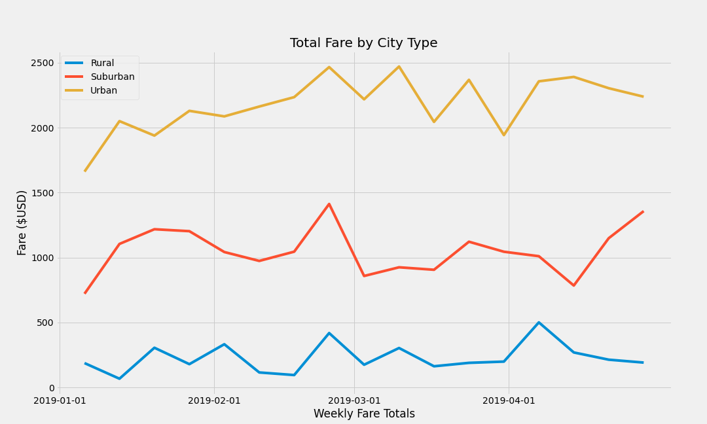
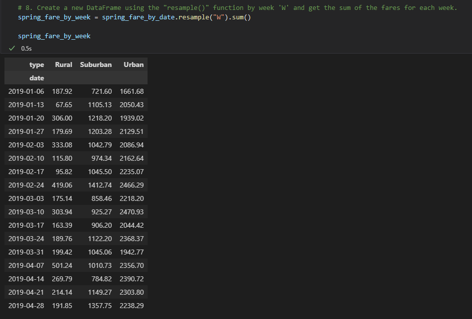
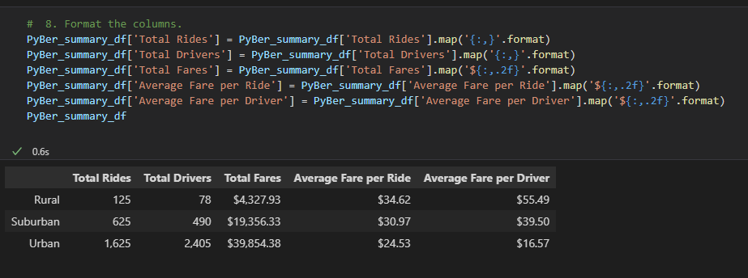

# PyBer Analysis

## Overview of Analysis
An analysis was performed on behalf of the client V. Isualize in order to discover possible trends in ride-sharing usage in rural, suburban, and urban areas from a period of January through April, 2019.

## Results of Analysis

As noted in the figure below (Total Fares by City Type), a distinctive split between the 3 city types and their average fares is evident. While overall the fares within each city type rise and fall independently, there does seem to be a correlation among all three of a spike in fares in the last week of February. In general, urban and suburban fares seem to rise and fall together, with urban fares experiencing more dramatic changes within each time period.

## Summary
In summary, resource planning for ride share services may want to investigate coordination between urban and suburban ride-sharing providers, as there seems to be correlation in their usage level shifts. However, planning for rural ride-shares appears to be necessary to stay independent. Average fare levels among rural riders are significantly higher than the other city types, most likely as a result of the longer distances necessary to travel to, from, and within a rural area. The large number of shifts in week over week rider fares in rural areas may be an opportunity for marketing to investigate. Riders in need of regular transportation in rural areas may be unaware of potential usage possibilities, and marketing targeted to riders using ride-share services during the high-fare weeks may lead to a more evenly distributed usage pattern. Follow-up investigation may also help in planning for those services if events prompting rural usage can be discovered. 

Further analysis may be in order if data is available about ride purpose or rider type, including the level of ride-share usage by rider. This data may be able to be combined with the current analysis to provide further insight into potential efficiencies. 

